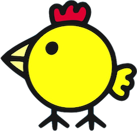

# Happy Mrs. Chicken - A Game Built in React

This is a game that made an appearance on the children's show, Peppa Pig. I've
re-made it as a web app game using React. I watch Peppa Pig daily - 24/7 - due
to it being my toddler's favorite show so far 😅 So I just had to remake it and
show off my React skills!

## Demo

<a href='https://happy-mrs-chicken.netlify.app' target='_blank' rel='noreferrer'>https://happy-mrs-chicken.netlify.app</a>

To see the real game as made by the original creators, view 
<a href='https://youtu.be/18vbpsOil_U?t=43' target='_blank' rel='noreferrer'>this Youtube video</a>.

## How To Play

First, click the play button. Then, click anywhere in the browser window to see the chicken lay an egg 
and move around the screen. The whole point of the game is to watch the chicken lay as many eggs as you
have the time for while it keeps track of how many eggs were laid. With every additional 50 eggs laid,
you will be congratulated!

## Things I'd Like to Add/Update/Change
- Update the egg to show it hatching before disappearing rather than it just disappearing
- Figure out a way to remove the baby chickens from the DOM without causing a crash

## Frameworks and Libraries

### Backend

Netlify - https://netlify.app

### Styling

SASS

### Third-Party

Animate.css - https://animate.style/ 
Canvas Confetti - https://www.npmjs.com/package/canvas-confetti 
Party Confetti Font - https://www.fontspace.com/party-confetti-font-f69513 
Use Sound - https://www.npmjs.com/package/use-sound

### UI

No fancy UI frameworks were used! It was all custom-written code by yours truly 💙

## Disclaimer

I do not own the theme music or the idea behind this game. This was re-created for learning
purposes only.
